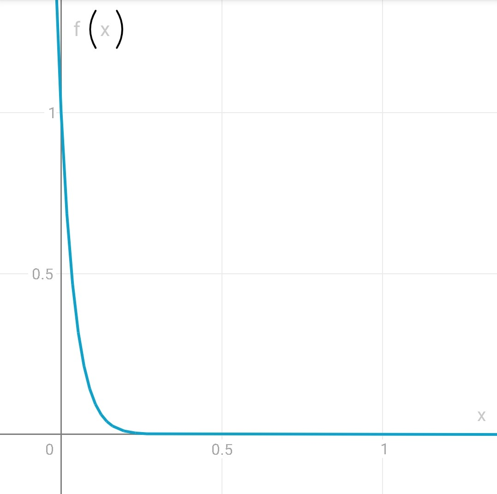
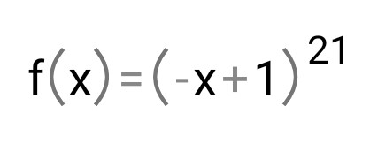
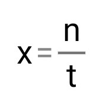

# Mis notas del proyecto

------

## Preliminares:

Decir q funciona con el encoding UTF-8...................

Para una mejor implementación del proyecto, se hizo necesaria las investigación de algoritmos, patrones y  estructuras de datos que previamente no conocía.

He utilizado Listas y Diccionarios, estructuras destinadas a un manejo más cómodo de los datos,  aprovechando las ventajas que brindan, por ejemplo para añadir y eliminar elementos de la colección con una mayor facilidad de la que nos brindan los array, o la relación que nos permite establecer en una misma estructura entre una llave y un valor.

También hago uso de las maneras más simples de estructuras tales como expresiones lambda para complementar algunos métodos de clases contenidas en `System` , como la clase `Enumerable`. El siguiente ejemplo determina si algún elemento `x` de una Lista `List<string> terms` satisface una condición `x == "~"` .

```c#
terms.Any(x => x == "~")
```

El código está bastante comentado, con las explicaciones de lo que hacen los algoritmos por secciones, e incluso a veces por línea.


## La idea:

La idea general del proyecto sigue la idea de *Singleton*, como patrón de diseño creacional. *Singleton* es una idea que básicamente se enfoca en la creación de una clase de intancia **única**, y accesible desde cualquier otra clase de mi programa. De esta manera, una vez creada, funciona como una base de datos que contiene la información dundamental del Corpus que no necesita de que el usuario haya realizado el query con anterioridad.

Una vez generada ésta base de datos, se ejecuta la interfaz visual de mi motor de búsqueda. Es entonces donde el usuario realiza la búsqueda y entra en juego la otra perte del proyecto, responder a la búsqueda.

...


## Mi implementación:

#### CorpusDB:


#### InputQuery:

La clase de instancia `InputQuery`, que va a instanciarse una vez el usuario haya hecho una búsqueda, su constructor será llamado desde el método `Moogle.Query`. Esta clase es la encargada de analizar la consulta del usuario y creará un objeto de su tipo que contiene toda la información de sus términos para la búsqueda por el motor. Teniendo en cuenta los operadores de búsqueda, separa los términos en Listas en dependencia de su objetivo en la búsqueda (las que **deben** aparecer en el documento de salida, las que tienen algún nivel de importancia, etc, así como una lista con todas las palabras de mi query)


#### Los operadores:

Para un manejo más personalizado del query por parte del usuario, he implementado una serie de operadores válidos que influyen directamente en los resultados de la búsqueda:

El operador: Stop Word `!`. Las palabras que vengan precedidas por este operador, hará que los documentos en las que aparezcan, no sean devueltos por el motor de búsqueda. ¿Cómo queda implementado?. Durante el tiempo de ejecución de mi método principal `Query`, se llama al método `Engine.GetStopOrNeededDocuments`, este método es el encargado de recorrer cada palabra ya previamente detectada como Stop Word, y devolver un array con las rutas correspondientes a los documentos donde aparecen dichas palabras. Este array es pasado luego a un método que decide cuáles documentos devolver.

El operador: Needed Word `^`. Las palabras que vengan precedidas por este operador, hará que los documentos en las que aparezcan, sean necesariamente devueltos por el motor de búsqueda. ¿La implementación?. Exactamente como ocurre con el operador anterior, se llama al mismo método que genera de nuevo un array, esta vez con los documentos que contienen las palabras que necesariamente deben estar en ellos al devolverlos.

El operador: Relevant Word `*`. Las palabras precedidas por este operador tienen una relevancia diferente a las palabras ordinarias del query, por tanto el score de las mismas se reevalúa en la matriz de los TF-IDF. De esta manera, se multiplica el valor del score por la cantidad de estrellas de relevancia de la palabra.

El operador: Related Words `~`. Este operador intermedio entre dos palabras es el ancargado de aumentar el score de las palabras que, por desición del usuario que hace el query, deberían importar más mientras más cercanas estén.  Para este operador me he basado en eurística y un cálculo con ayuda del análisis matemático. Para ello he concluido que: dos palabras en un documento no van a estar realmente relacionadas hasta que estén los suficientemente cerca una de la otra, respetando el orden en que aparecen.



 De esta manera, las imágenes muestran la función $f(x)$, de la cuál solo nos resulta de interés el intervalo continuo $[0, 1]$. Esta función recibe el parámetro $x$, que representa la cercanía de las palabras en el documento. $x$, está definida como el cociente de la diferencia entre la máxima distancia a la que pueden estar las palabras en un documento y la cantidad de palabras que están entre ellas $(t-x)$, con el mismo parámetro $t$. A continuación algunos ejemplos de evaluaciones para entender mejor los resultados.

- Caso extremo favorable:  $x = t /t$   =>   $f(x) = 1$
- Caso extremo desfavorable:  $x = 0/t$   =>   $f(x) = 0$
- Caso 1/4 de distancia:  $x = (t/4)/t$   =>   $f(x) = 0,0023$  *aprox*
- Caso 1/50 de distancia:  $x=(t/50)/t$   =>   $f(x) = 0,6542 $ *aprox*

También podemos observar que mientras más largo el documento, más puntúa si están a la misma distancia

- Caso $f(1/10) = 0,10$
- Caso $f(1/100) = 0.81$
- Caso $f(1/1000) = 0,98$

La forma en que se evalúa el score de este operador consiste en llevar la sumatoria de las evaluaciones de $f(x)$ por cada vez que se encuentre el par en el documento. Luego este score será dividido en 2 partes, las que se suman directamente a los Tf-Idf de las dos palabras relacionadas en el propio documento.

Ambos últimos 2 operadores toman efecto tras el llamado del método `Scorer.ScoreOperators`, encargado de refactorizar los Tf-Idf de las palabras respecto a los operadores.