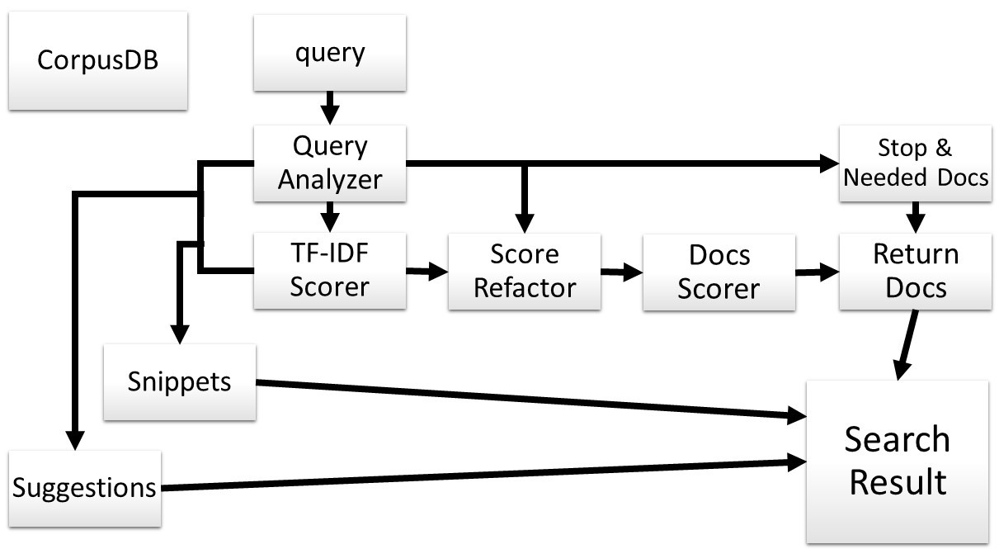

# Mis notas del proyecto 💻

------

## Preliminares 📝:

Para una mejor implementación del proyecto, se hizo necesaria las investigación de algoritmos, patrones y  estructuras de datos que facilitaran y optimizaran de alguna manera el propósito del proyecto.

Se utilizan estructuras destinadas a un manejo más cómodo de los datos, tales como las Listas y Diccionarios, aprovechando las ventajas que brindan, entre otros, para añadir y eliminar elementos de una colección con mayor facilidad de la que nos brindan los array, o la relación que nos permite establecer en una misma estructura entre una llave y un valor.

También hago uso de las maneras más simples de estructuras, tales como expresiones lambda para complementar algunos métodos de clases contenidas en `System` , como la clase `Enumerable`. El siguiente ejemplo determina si algún elemento `x` de una Lista `List<string> terms` satisface una condición `x == "~"` .

```c#
terms.Any(x => x == "~")
```


## La idea💡: 

La idea general del proyecto es un motor de búsqueda que se basa en una colección de documentos para responder a una consulta del usuario, de manera que los documentos deben ser archivos de tipo `.txt` y con Encoding UTF-8. El proyecto sigue la idea de *Singleton*, como patrón de diseño creacional, y este último constituye una idea que básicamente se enfoca en la creación de una clase de intancia **única**, y accesible desde cualquier otra clase de mi programa. De esta manera, una vez creada, funciona como una base de datos que contiene la información fundamental del Corpus que no necesita de que el usuario haya realizado el query con anterioridad.

Una vez generada ésta base de datos, se ejecuta la interfaz visual de mi motor de búsqueda y es entonces donde el usuario realiza la consulta y entra en juego la otra parte del proyecto: responder a la búsqueda. El motor de búsqueda se apoya en el **modelo de espacio vectorial** de los sistemas de recuperación de información y en la estadística de puntuación y evaluación **TF-IDF**. Para un entendimiento más preciso del funcionamiento del motor, se abordará con más detalle en la próxima sección.


## Los detalles de la implementación👨‍💻: 

Aparece por secciones donde hago referencia a las clases del proyecto y las partes fundamentales de la composición de mi código.


#### CorpusDB: "Mi clase Singleton"

La clase `CorpusDB` es la clase de instancia única que se encargará de reunir la información del Corpus, y siguiendo la idea de *Singleton*, funciona como variable de acceso global al resto de mis clases. Para su correcto funcionamiento, contiene una variable encargada de instanciar la clase desde ella misma, esto debido a que el constructor es privado, precisamente para evitar que se acceda a él y se cree otra instancia de la clase. Además tiene una propiedad pública encargada de copiar la instancia cada vez que se desee acceder a la clase. 

La clase como función de base de datos, se encarga de crear una serie de propiedades previas a la realización de la consulta, basándose en el Corpus de los documentos. Con su instanciación recorre cada documento de la carpeta `Content`, de los cuales recopila información tal como: una lista con los string que representan todas las palabras que existen en mi base de datos de documentos, o el Diccionario que, a cada documento, le asigna otro Diccionario con las palabras como *key*, y la frecuencia con que aparecen en el documento como *value*.

Esta clase es llamada desde `MoogleServer`, desde la clase `Program.cs`, justo antes de ejecurase el llamado a que se ejecute la aplicación de mi programa. Tras la ejecución del programa se abre la interfaz visual de pa aplicación y es doende el usuario se dispone a realizar la consulta.


#### Moogle class:

La clase estática `Moogle` es la que contiene al método `Query`, este método es el que se ejecuta una vez el usuario hace la consulta, y como es lógico, recibe la consulta del mismo. Este método forma una estructura casi lineal donde cada llamado necesita de los anteriores. Por ese método pasan todos los llamados desde la misma introducción del query, hasta la salida de los resultados de búsqueda. 




#### Query Analyzer:

La clase de instancia `InputQuery`,  va a instanciarse una vez el usuario haya hecho una búsqueda, su constructor será llamado desde el método `Moogle.Query`. Esta clase es la encargada de analizar la consulta del usuario y creará un objeto de su tipo que contiene toda la información de sus términos para la búsqueda por el motor. Teniendo en cuenta los operadores de búsqueda, separa los términos en Listas en dependencia de su objetivo en la búsqueda (las que **deben** aparecer en el documento de salida, las que tienen algún nivel de importancia, etc, así como una lista con todas las palabras de mi query)


#### Stop & Needed Docs:

En esta sección se separan en arrays los documentos que contienen a las palabras con los operadores `!` & `^`, para posteriormente tenerlos en cuenta a la hora de escoger los documentos a devolver. Esto queda más detallado en la sección dedicada a los operadores.


#### TF-IDF Scorer:

Esta es la parte donde se genera la matriz de los TF-IDF de las palabras del query, respecto a los documentos. El TF-IDF nos da una medida de cuán relevante es una palabra para un documento, en una colección de documentos. Por tanto cada palabra tendría su puntuación. Existen varias formas de calcular esta medida, la que se utiliza es la propuesta a continuación, pero primero separemos este concepto en dos partes:

**Term Frequency**(TF): Para ello hemos tomado una frecuencia normalizada, la cual se calcula dividiendo la frecuencia bruta de la palabra en el documento $(n)$, entre la frecuencia máxima de una palabra en el documento $(m)$. Quedaría: $tf = n/m$

**Inverse Document Frequency**(IDF): De manera general, expresa cuán rara es la palabra en un corpus de documentos, y su fórmula queda expresada como el logaritmo del cociente entre, el total de documentos $(d)$ y la cantidad de documentos donde aparece la palabra $(d')$. Quedaría: $log(d/d')$. Es un hecho que existen palabras que pueden no aparecer en los documento, por ello deberíamos tener en cuenta que la división entre 0 en el argumento del logaritmo se nos indefiniría, para ello sumamos al denominador del cociente un valor insignificante que evite la idefinición de la expresión; en este caso fue 0.01. Ahora...¿Qué pasaría con la base del logaritmo?¿Nos serviría cualquier base?. En un principio sí, se podría hacer con cualquier base siempre y cuando sea la misma que se utilice en todas las palabras. Pero...una base cualquiera, haría que la puntuación que nos da el IDF nos dé resultados en diferentes intervalos de variación, en dependencia del tamaño del corpus. Es decir, tomando una base $2$, para un corpus de 10 documentos los valores del IDF estarían en el intervalo [0 - 3.32193]; pero si el corpus tuviera 100 elementos (dato que no será fijo), entonces el intervalo sería [0 - 6.64386]. Por tanto, para un mayor control sobre el score que dejarían nuestras palabras en los documentos, definimos una base para el logaritmo, en dependencia de la cantidad de documentos del corpus. Tomaríamos como base: la parte entera de la raíz cuadrada de la cantidad de documentos del corpus $(d)$. Quedaría: $base = Truncate(sqrt(d))$. De esta manera definimos un intervalo [0 - 2] en el que van a quedar los valores del IDF.

**TF-IDF**: La puntuación final quedaría como el producto de los dos valores obtenidos anteriormente, de esta manera tendríamos el peso de las palabras en los documentos del corpus.


#### Score Refactor:

En esta sección lo que hacemos es reevaluar los valores del TF-IDF de aquellas palabras que se vean afectadas por los operadores `*` & `~`. Los detalles de como puntúan los operadores se analizan luego en la sección dedicada a los mismos.


#### Docs Scorer:

Para evaluar el ranking de los documentos, teniendo la matriz de los TF-IDF de todas sus palabras, he opatado por una vía más intuitiva. Simplemente definiremos el score de cada documento como la suma de los valores del TF-IDF de todas las palabras del query que en él aparecen. Algo tan sencillo como sumar todos los elementos de una columna de una matriz.


#### Return Docs:

Lo primero que debemos tener en cuenta en esta sección es identificar a aquellos documentos que con anterioridad marcamos como *Stop & Needed Docs*, y realizar las acciones que hagan que se cumplan los propósitos de los operadores. 

En un segundo momento deberíamos ordenar los documentos en dependencia del score calculado de los mismos en la sección anterior. Para ello tenemos el método `SortTill`, que los va ordenando hasta que llegue el punto en que los scores de los documenos resultantes sean menores que un valor predefinido(0.1) que nos indica un punto relativo donde los documentos ya no tienen relevancia alguna. En dependencia de lo anterior, ahora tocaría decidir cuantos documentos vamos a devolver como resultado de la búsqueda. Para ello, tomaremos como máximo 10 resultados, por lo que si la lista que tiene nuestros posibles documentos a devolver tiene más de esta cantidad, no quedaríamos solo con los 10 de más alto score; en el caso contrario, nos los quedaríamos todos.


#### Suggestions:

El algoritmo analiza cada una de las palabras del query en busca de aquellas que, quizás por error de escritura no aparezcan en ningún documento del corpus o que sean prácticamente irrelevantes para todos los documentos. Ésta irrelevancia viene dada por un valor por defecto de 0.1f, de esta manera se intentará buscar una suggerencia para las palabras que resulten irrelevantes en el corpus.

Entonces para cada una de las palabras analizaremos mediante el algoritmo de la Distancia de Leveishtein, las distancia a la que están de la original, pero no analizaremos todas las palabras, sino solo las que tengan un tamaño relativamente cercano (2 caracteres más y 2 menos). Luego guardaríamos en una lista todas las palabras que tengan la menor distancia encontrada. Aún tenemos varias palabras, así que para escoger una, me quedaré con la palabra que más relevante resulte para el corpus, siempre y cuando tenga un score superior a 0.1f, de esta manera aseguramos que la sugerencia que se proponga **"en la mayoría de los casos"**, tenga resultados en la búsqueda.

En el caso en que no tenga ninguna sugerencia, devolvería un valor arbitrario que luego será detectado a la hora de imprimir el suggestion en pantalla.


#### Snippet:

El snippet consiste en un fragmento del texto, en el que aparece al menos una parte de la consulta del usuario, en los textos del corpus. Esto nos permite una visualización previa del contenido del texto, antes de acceder al documento en sí. Para escoger qué fragmento devolver, decidimos primero qué palabra de la consulta del usuarios es en realidad más relevante. Para ello usaremos los valores calculados previamente de los TF-IDF de las palabras del query, entonces, sumando los valores de toda la fila, obtendremos por cada palabra, un valor que las identifica con el resto en cuando a relevancia en el corpus. Teniendo lo anterior, podemos ordenar las palabras por ese valor de relevancia, y entonces extraer para el snippet de cada documento, la palabra más relevante que esté contenida en él.

Teniendo la palabra y el texto donde buscarla, ¿con qué fragmento nos quedaríamos?. Primero lo que hacemos es separar el texto en oraciones, y entonces tomaríamos para devolver la primera oración donde aparece la palabra que queremos mostrar. Para evitar textos tan largos, si la oración excede de las 30 palabras lo que haríamos es quedarnos con las 15 palabras anteriores y las 15 posteriores a la ubicación de mi palabra, siempre que no nos salgamos de la oración.


#### SearchResult:

Teniendo ya todo lo que necesitamos devolver al usuario, vamos a convertir cada documento a devolver, en un objeto de tipo `SearchItem`, pasándole al constructor como parámetros: el título, el snippet y el score de los documentos a devolver. Estos `SearchItem` los tendremos en una colección, la cual servirá, junto con la sugerencia antes generada, como parámetro de la clase `SearchResult`. Esta última será el retorno del método `Query`. A partir de este punto solo quedaría que la interfaz interprete la clase y la muestre al usuario.


#### Los operadores:

Para un manejo más personalizado de la búsqueda por parte del usuario, he implementado una serie de operadores válidos que influyen directamente en los resultados:

El operador: Stop Word `!`. Las palabras que vengan precedidas por este operador, hará que los documentos en las que aparezcan, no sean devueltos por el motor de búsqueda. ¿Cómo queda implementado?. Durante el tiempo de ejecución de mi método principal `Query`, se llama al método `Engine.GetStopOrNeededDocuments`, este método es el encargado de recorrer cada palabra ya previamente detectada como Stop Word, y devolver un array con las rutas correspondientes a los documentos donde aparecen dichas palabras. Este array es pasado luego a un método que decide cuáles documentos devolver.

El operador: Needed Word `^`. Las palabras que vengan precedidas por este operador, hará que los documentos en las que aparezcan, sean necesariamente devueltos por el motor de búsqueda. ¿La implementación?. Exactamente como ocurre con el operador anterior, se llama al mismo método que genera de nuevo un array, esta vez con los documentos que contienen las palabras que necesariamente deben estar en ellos al devolverlos.

El operador: Relevant Word `*`. Las palabras precedidas por este operador tienen una relevancia diferente a las palabras ordinarias del query, por tanto el score de las mismas se reevalúa en la matriz de los TF-IDF. De esta manera, se multiplica el valor del score obtenido del TF-IDF por la cantidad de estrellas de relevancia de la palabra.

El operador: Related Words `~`. Este operador intermedio entre dos palabras es el ancargado de aumentar el score de las palabras que, por desición del usuario que hace el query, deberían importar más mientras más cercanas estén.  Para este operador apoyamos de un cálculo con ayuda del análisis matemático. Para ello he decidido y concluido que: dos palabras en un documento no van a estar realmente relacionadas hasta que estén los suficientemente cerca una de la otra, respetando el orden en que aparecen.


 De esta manera, las imágenes muestran la función $f(x)$, de la cuál solo nos resulta de interés el intervalo continuo $[0, 1]$. Esta función recibe el parámetro $x$, que representa la cercanía de las palabras en el documento. $x$, está definida como el cociente de la cantidad de palabras que están entre ellas: $(n)$, con la cantidad máxima de palabras que puede haber entre ellas, o sea, la cantidad de palabras del documento: $(t)$. A continuación algunos ejemplos de evaluaciones para entender mejor los resultados.

- Caso extremo palabras distantes:  $x = t /t$   =>   $f(x) = 0$
- Caso extremo palabras cercanas:  $x = 0/t$   =>   $f(x) = 1$
- Caso 1/4 de distancia:  $x = (t/4)/t$   =>   $f(x) = 0,0023$  *aprox*
- Caso 1/50 de distancia:  $x=(t/50)/t$   =>   $f(x) = 0,6542 $ *aprox*

También podemos observar que mientras más largo el documento, más puntúa si están a la misma distancia

- Caso $f(1/10) = 0,10$
- Caso $f(1/100) = 0.81$
- Caso $f(1/1000) = 0,98$

La forma en que se evalúa el score de este operador consiste en llevar la sumatoria de las evaluaciones de $f(x)$ por cada vez que se encuentre el par en el documento. Luego este score será dividido en 2 mitades, las cuales serán sumdas directamente a los TF-IDF de las dos palabras relacionadas en el propio documento.

Ambos últimos 2 operadores toman efecto tras el llamado del método `Scorer.ScoreOperators`, encargado de refactorizar los TF-IDF de las palabras en correspondencia con los criterios de los operadores.


## Bibliografía:

https://es.wikipedia.org/wiki/Singleton

https://refactoring.guru/es/design-patterns/singleton

https://sites.google.com/site/algoritmossimilaridaddistancia/distancia-de-levenshtein

https://es.wikipedia.org/wiki/Modelo_de_espacio_vectorial

https://es.wikipedia.org/wiki/Tf-idf

